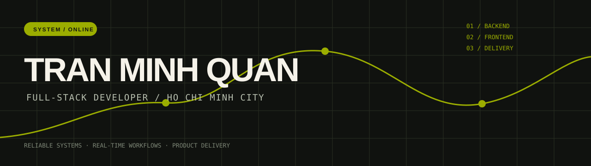

<p align="center">
  
</p>

<p align="center">
  
</p>

<p align="center">
  <a href="https://quan-portfolio-ten.vercel.app"></a>
  <a href="https://www.linkedin.com/in/qu%C3%A2n-tr%E1%BA%A7n-8b4249372/"></a>
  <a href="mailto:tranminhquan.acc@gmail.com"></a>
</p>

## About

I am a Full-stack Developer who enjoys turning operational problems into clear, maintainable software. My work spans backend services, responsive interfaces, data flows, and deployment—so a feature can move from idea to production with context intact.

```text
NOW BUILDING  →  business workflows · real-time event systems · practical product delivery
```

## Selected work

<table>
  <tr>
    <td width="33%" valign="top">
      <a href="https://quan-portfolio-ten.vercel.app/projects/fcr-customer-request-system">
        
      </a>
      <br /><br />
      <strong>FCR</strong><br />
      <sub>FPT Telecom · Request management system</sub><br /><br />
      ASP.NET Core, React, Oracle SQL, Redis
    </td>
    <td width="33%" valign="top">
      <a href="https://quan-portfolio-ten.vercel.app/projects/vds-ai-cctv-weighbridge">
        
      </a>
      <br /><br />
      <strong>VDS / AI CCTV</strong><br />
      <sub>ITD Solutions · Real-time alerting</sub><br /><br />
      Event processing, SQL Server, Docker
    </td>
    <td width="33%" valign="top">
      <a href="https://quan-portfolio-ten.vercel.app/projects/eigakan-movie-sharing-platform">
        
      </a>
      <br /><br />
      <strong>Eigakan</strong><br />
      <sub>Graduation project · Shared movie platform</sub><br /><br />
      SignalR, AWS S3, BunnyCDN, Cloudinary
    </td>
  </tr>
</table>

See the [full case studies](https://quan-portfolio-ten.vercel.app/projects) for project context, responsibilities, and gallery images.

## Toolkit

<p>
  
</p>

<details>
  <summary><strong>What I work with</strong></summary>
  <br />

  - **Backend:** C#, ASP.NET Core, Entity Framework, REST APIs, SignalR
  - **Frontend:** React, TypeScript, Next.js, Tailwind CSS, Ant Design, Redux Toolkit
  - **Data:** SQL Server, Oracle SQL, MongoDB, Redis
  - **Delivery:** Docker, GitHub, GitLab, Postman, Figma
</details>

## Experience

| Role | Company | Focus |
| --- | --- | --- |
| Software Developer Intern | ITD Solutions | VDS, AI CCTV alerts, toll weighbridge systems, real-time processing, Docker delivery |
| Full-stack Developer Intern | FPT Telecom | Customer-request workflows, ASP.NET Core APIs, React interfaces, Oracle SQL, Redis |
| Back-end Developer Intern | FPT Software | C# backend logic, REST APIs, Entity Framework, dependency injection |

<p align="center">
  <strong>Open to full-stack engineering opportunities and practical product collaboration.</strong><br />
  <a href="mailto:tranminhquan.acc@gmail.com">tranminhquan.acc@gmail.com</a>
</p>
